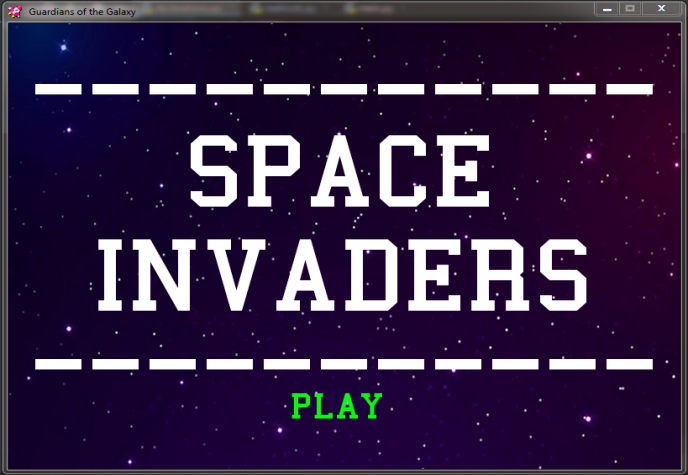
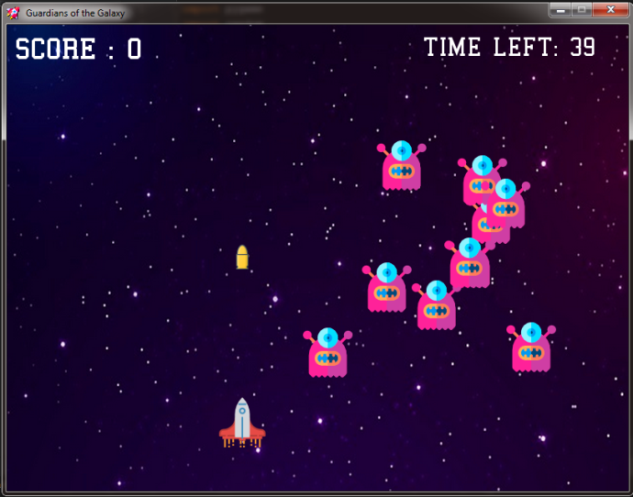
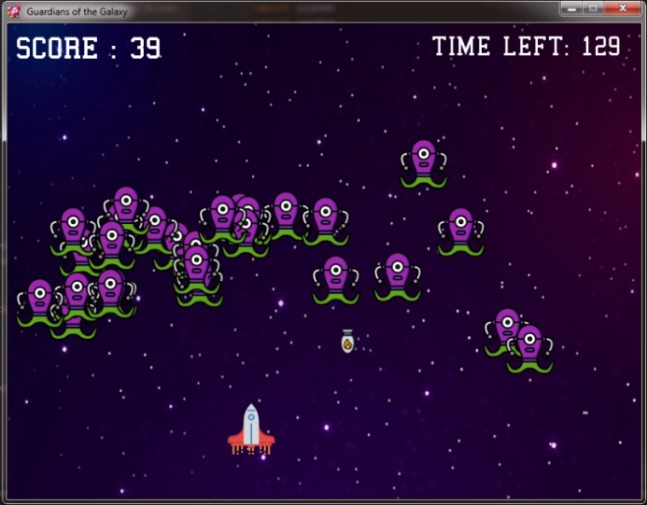
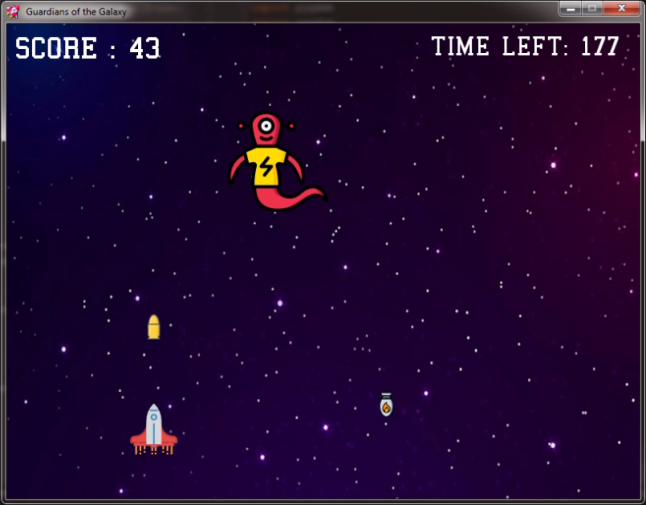

# Space-Invaders-Game-using-Python
Space Invaders Game using Python programming language

The game, called Space Invaders, is a 2D arcade like space shooter built with Python and PyGame package. The main idea of the game is for the player to destroy all the enemy
spaceships by shooting bullets and reach the last level of the game where intelligent enemy alien will do the absolute best to defeat the player spaceship. 
Along the intermediate levels, the alien spaceships will try to knockout the player by either colliding
with it or shooting bullets.

The player spaceship is controlled via keyboard and the enemy spaceships have a predefined movement. 
The player has to dodge enemy bullets in order to survive the continuous attack coming from the opponent forces.

